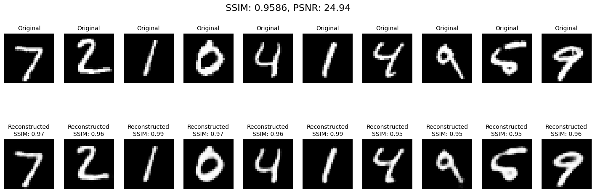
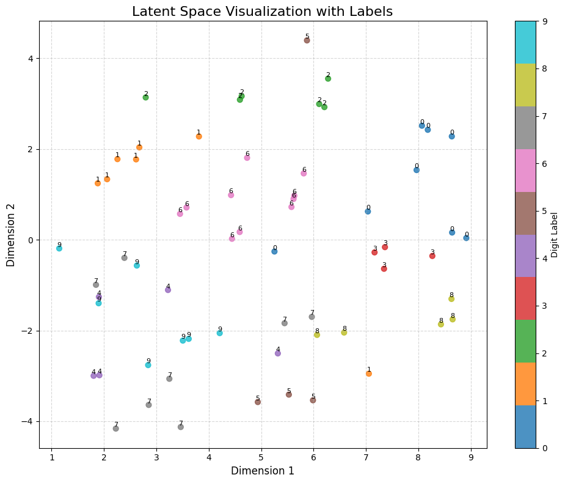
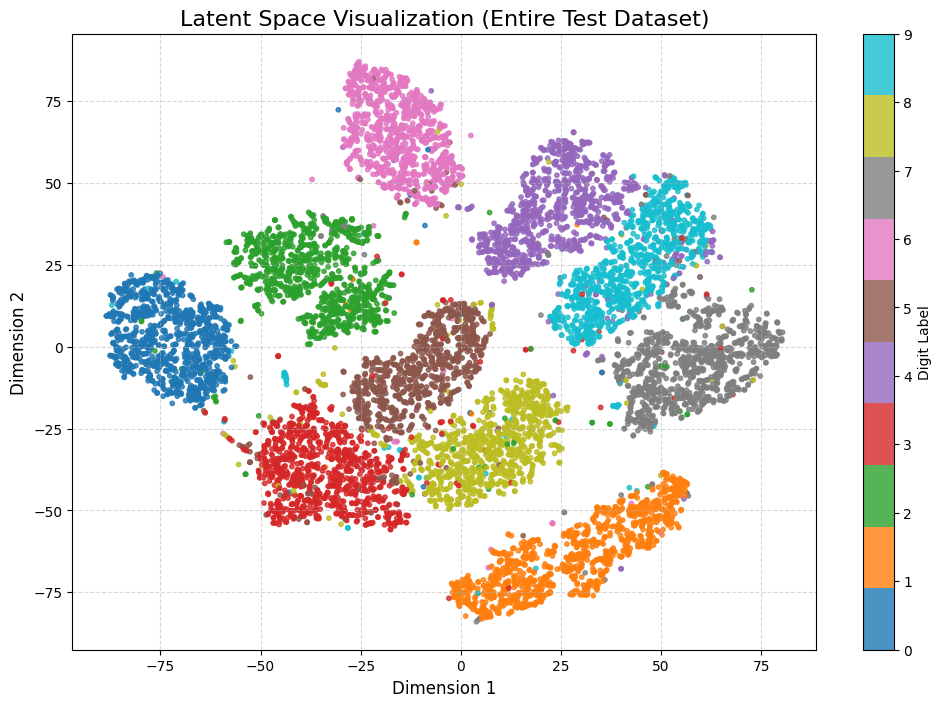
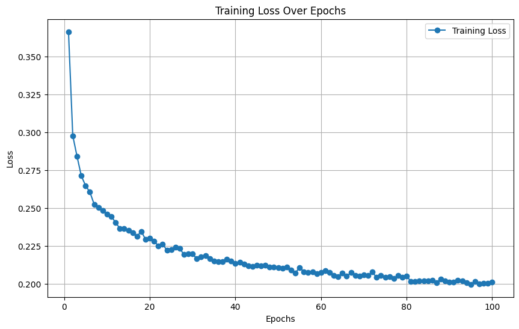
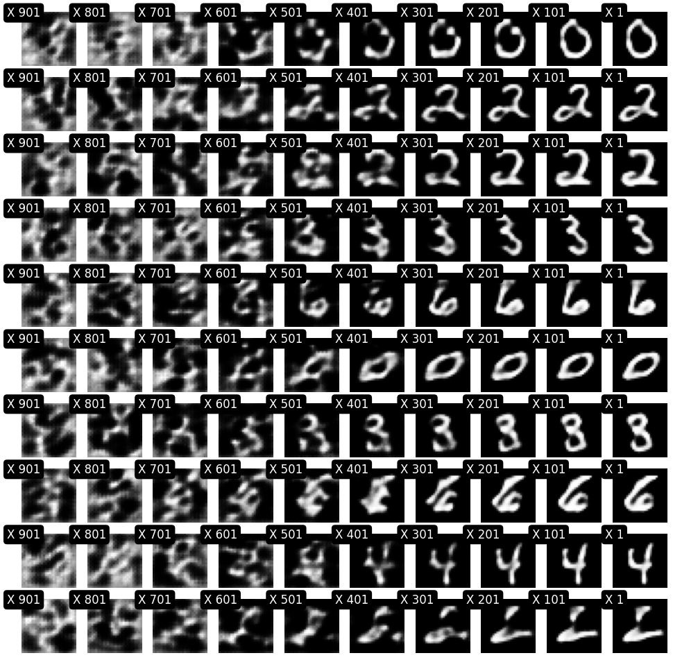
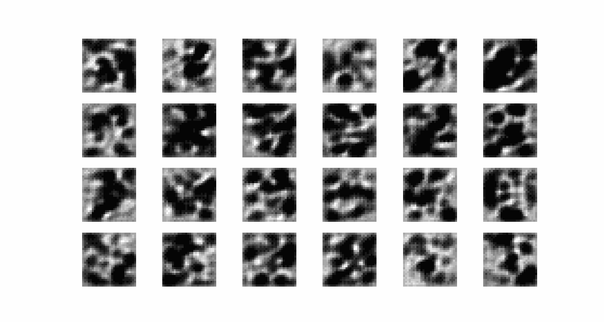

# **Diffusion Models on MNIST Dataset 🌀**

[](https://www.python.org/downloads/release/python-380/)
[]()

Welcome to this project exploring **Diffusion Models** on the **MNIST** dataset! 🚀

This repository focuses on generating and reconstructing handwritten digits by integrating:
- **Autoencoders** with Convolutional Attention Blocks (CABs)
- **Denoising Diffusion Probabilistic Models (DDPM)** using U-Net

---

## **Table of Contents**
- [Overview](#overview)
- [Autoencoder with CABs](#autoencoder-with-cabs)
- [Diffusion Model (DDPM)](#diffusion-model-ddpm)
- [Results and Visualizations](#results-and-visualizations)
- [Future Directions](#future-directions)

---

## **Overview**
This project aims to reconstruct MNIST digits by encoding them into a latent space and progressively denoising them through a **Diffusion Model**.

### Highlights:
- 🧠 **Latent Space Representations** - Using attention mechanisms for better feature extraction.
- 🌀 **Diffusion Process** - Forward and reverse diffusion to model the data distribution.
- 📊 **Visualization** - Monitoring performance through SSIM/PSNR scores and latent space scatter plots.

---

## **Autoencoder with CABs**
- **Encoder** compresses MNIST digits into latent representations using convolutional layers and attention.
- **Decoder** reconstructs the digits from latent space.

### Channel Attention Block (CAB)
CABs refine the feature maps by:
- 🌐 **Global Average Pooling** to extract spatial information.
- 🔄 **Two Conv2D Layers** to scale the feature channels.
- ✨ **Sigmoid Activation** to apply attention.

```python
class CALayer(nn.Module):
    def __init__(self, channel, reduction=16, bias=False):
        super(CALayer, self).__init__()
        self.avg_pool = nn.AdaptiveAvgPool2d(1)
        self.conv_du = nn.Sequential(
            nn.Conv2d(channel, channel // reduction, 1, bias=bias),
            nn.ReLU(inplace=True),
            nn.Conv2d(channel // reduction, channel, 1, bias=bias),
            nn.Sigmoid()
        )
    def forward(self, x):
        y = self.avg_pool(x)
        y = self.conv_du(y)
        return x * y
```

---

## **Diffusion Model (DDPM)**
- 🌪️ **Forward Diffusion** gradually adds noise to the latent representation.
- 🌟 **Reverse Diffusion** predicts and removes noise step by step to reconstruct the original image.

### U-Net Architecture
The core of the diffusion model is a U-Net, enhanced with:
- **Residual Blocks**
- **Attention Mechanisms**
- **Time Embeddings** for each diffusion step

---

## **Results and Visualizations**
The project features multiple visual outputs that highlight the training and performance of the model.

### 1. **Reconstruction Performance**
A side-by-side comparison of **original** vs **reconstructed** images. High **SSIM** and **PSNR** scores indicate effective reconstructions.

**Visualization:**


---

### 2. **Latent Space Visualization**
Projection of latent space using **t-SNE** for a batch and the full test dataset.

**Batch Visualization:**


**Full Test Dataset:**


---

### 3. **Training Loss Curve**
Tracking the loss of the diffusion model over epochs.

**Loss Plot:**


---

### 4. **Denoising Visualization (Step by Step)**
Images progress from noisy states (left) to denoised outputs (right), demonstrating the stepwise denoising process.

**Sample Visualization:**


---

### 5. **Grid Diffusion GIF**
A GIF that visualizes multiple samples as they undergo diffusion from noise to clear MNIST digits.

**GIF Animation:**


---

## **Formulas and Key Concepts**
The project applies **unconditional latent diffusion** inspired by classic DDPMs but focuses on the latent space. Below is a simplified breakdown of the key concepts:

<p align="center">
$x_t = \sqrt{\bar{\alpha}_t} x_0 + \sqrt{1 - \bar{\alpha}_t} ε$
</p>

Where:
- \(x_t\) is the latent at timestep \(t\)
- \(α_t\) represents noise schedule
- \(ε\) is the random noise

**Reverse Process (Denoising):**
<p align="center">
$x_{t-1} = \frac{1}{\sqrt{\alpha_t}} (x_t - (1 - \alpha_t) ε)$
</p>

This iterative denoising helps reconstruct the original data.

---

## **Future Directions**
Here are a few ideas to extend this project:
- 🧱 **Larger U-Net Models** for higher quality image synthesis
- 🔄 **Dynamic Diffusion Schedules** to speed up convergence
- 📈 **Experiment with Other Datasets** like Fashion MNIST or CIFAR-10

---

### 🚀 Happy Training! 🧠

